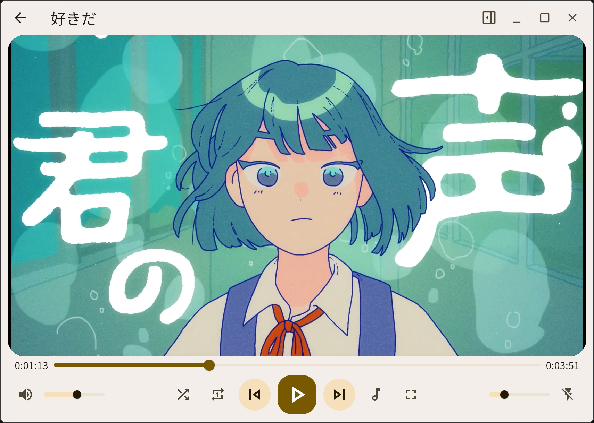
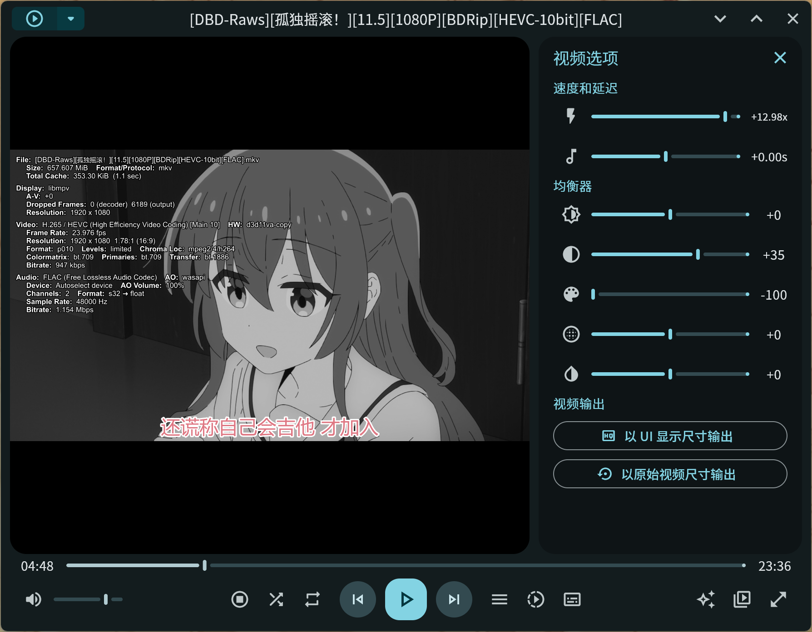
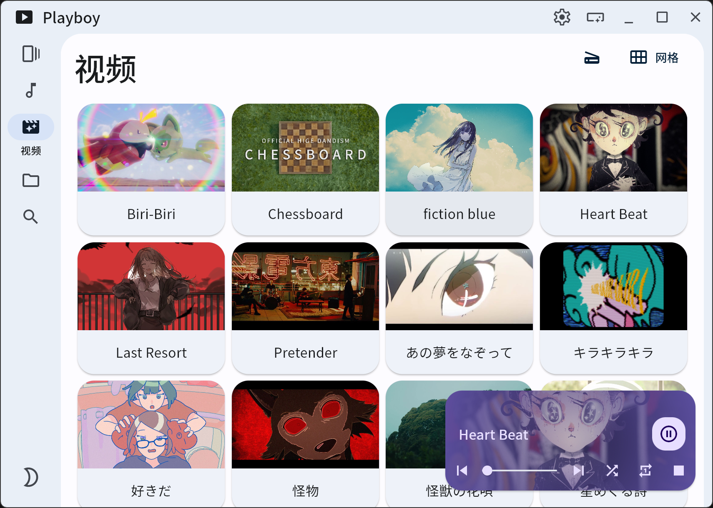
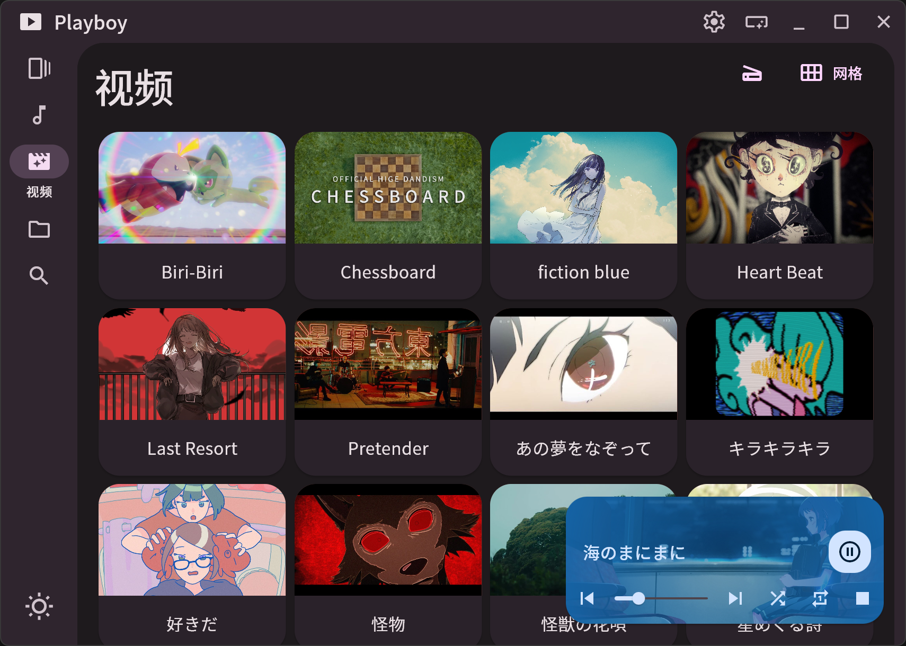
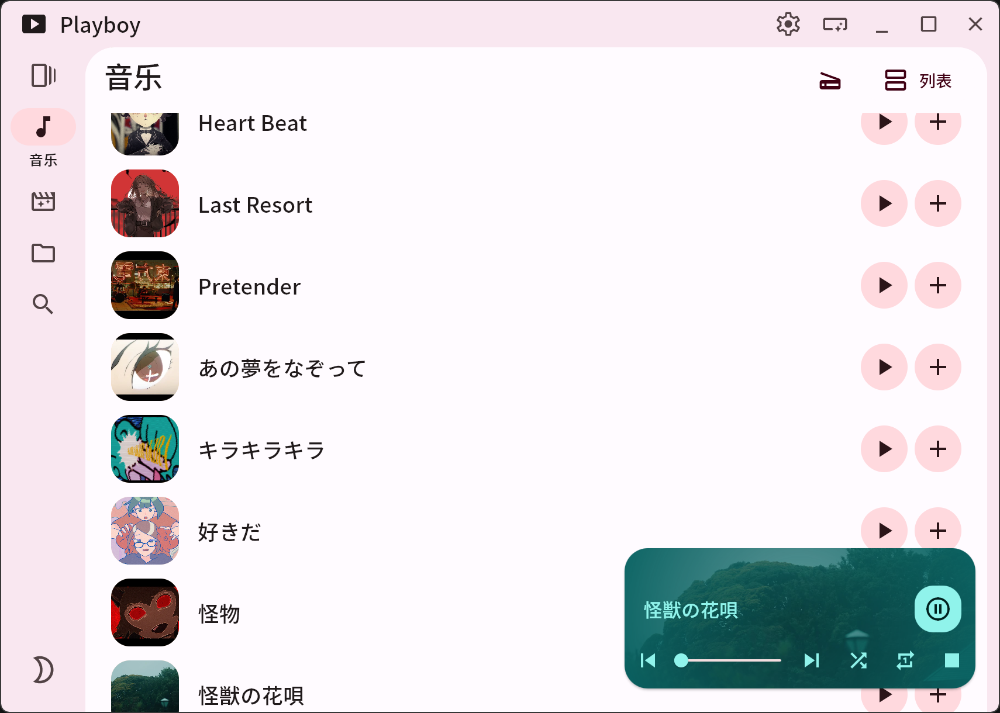
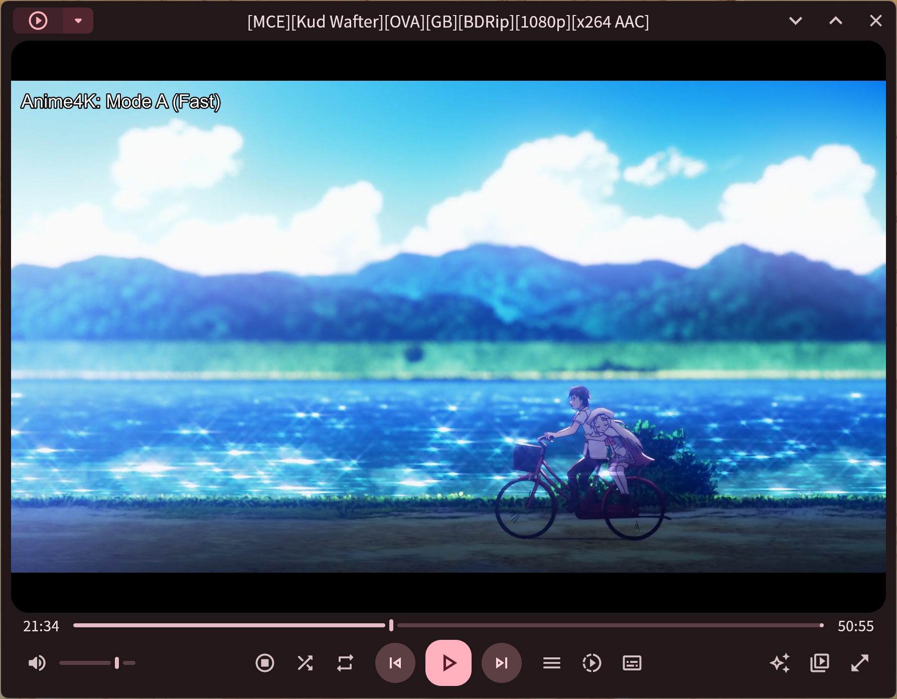

# Playboy Player

[English version](./README_en.md)

> 本项目目前通过 Github Actions 自动编译 **Windows**, ~~**macOS**~~ 和 **android** 测试版本, 可[在此](https://github.com/Playboy-Player/Playboy/actions)下载体验.

使用 [Flutter](https://flutter.dev/) 开发的媒体播放器, 界面使用 [Material You](https://m3.material.io/) 设计风格.


## 界面截图

<table>
  <tr>
    <td>
      
    </td>
    <td>
      
    </td>
  </tr>
  <tr>
    <td>
      
    </td>
    <td>
      
    </td>
  </tr>
  <tr>
    <td>
      
    </td>
    <td>
      
    </td>
  </tr>
</table>

## 功能

[查看开发计划 & 进度](https://github.com/orgs/Playboy-Player/projects/3)

- [x] 主题颜色设置 & 深色模式支持
- [ ] 多语言支持
- [x] 播放本地和网络媒体
- [x] 迷你播放器模式 (Windows & macOS)
- [x] 设置为系统打开方式 (Windows)
- [x] 播放列表功能 (随机播放, 单曲循环)
- [x] 任意倍速调节
- [ ] 歌词和字幕
- [ ] 文件下载功能
- [x] 搜索媒体文件和播放列表

## 跨平台支持情况

### Windows

需要安装 [Flutter](https://docs.flutter.dev/get-started/install/windows/desktop?tab=vscode), [Visual Studio 2022](https://visualstudio.microsoft.com/zh-hans/downloads/) C++ 工作负载 (或安装 [VS 2022 生成工具](https://aka.ms/vs/17/release/vs_BuildTools.exe))

flutter doctor 输出内容示例:

```
Doctor summary (to see all details, run flutter doctor -v):
[✓] Flutter (Channel stable, 3.24.1, on Microsoft Windows [版本 10.0.22631.4037], locale zh-CN)
[✓] Windows Version (Installed version of Windows is version 10 or higher)
[✓] Visual Studio - develop Windows apps (Visual Studio 生成工具 2022 17.11.1)
[✓] Connected device (3 available)
[✓] Network resources
```

在项目文件夹下运行 `flutter build windows` 以生成 Windows 可执行程序

### Linux

> 目前 Linux 版本存在较多 Bug, 如播放时切换页面可能导致应用崩溃, 迷你播放器显示尺寸错误等

需要安装 [Flutter](https://docs.flutter.dev/get-started/install/linux), libmpv-dev.

flutter doctor 输出内容示例:

```
Doctor summary (to see all details, run flutter doctor -v):
[✓] Flutter (Channel stable, 3.22.2, on Debian GNU/Linux 12 (bookworm) 5.15.153.1-microsoft-standard-WSL2, locale
    en_US.UTF-8)
[✓] Linux toolchain - develop for Linux desktop
[✓] Connected device (1 available)
[✓] Network resources 
```

在项目文件夹下运行 `flutter build linux` 以生成 Linux 可执行程序

### macOS

flutter doctor 输出内容示例:

```
Doctor summary (to see all details, run flutter doctor -v):
[✓] Flutter (Channel stable, 3.27.2, on macOS 15.2 24C101 darwin-arm64, locale
    zh-Hans-CN)
[!] Xcode - develop for iOS and macOS (Xcode 16.2)
    ✗ Unable to get list of installed Simulator runtimes.
[✓] VS Code (version 1.96.4)
[✓] Connected device (3 available)
[✓] Network resources
```

如果仅需编译 macOS 应用, Xcode 无需安装 iOS SDK.

### android

> 针对手机的布局优化尚未完成, 建议在平板设备上体验.

flutter doctor 输出内容示例:

```
Doctor summary (to see all details, run flutter doctor -v):
[✓] Flutter (Channel stable, 3.24.1, on Microsoft Windows [版本 10.0.22631.4169], locale zh-CN)
[✓] Windows Version (Installed version of Windows is version 10 or higher)
[✓] Android toolchain - develop for Android devices (Android SDK version 34.0.0)
[✓] Android Studio (version 2024.2)
[✓] Connected device (3 available)
[✓] Network resources
```

## 为本项目做出贡献

如果您在使用中发现 bug 或者希望添加某些功能, 请 [新建一个 issue](https://github.com/Playboy-Player/Playboy/issues/new).  
也欢迎直接 Pull Request 提交代码贡献.

## Star History

[](https://star-history.com/#Playboy-Player/Playboy&Date)