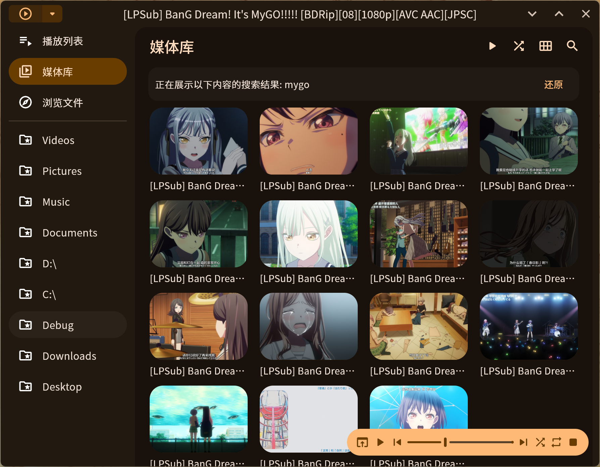

# Playboy Player
[中文](./README.md) | English  

A cross-platform media player with Material 3 design.

[](https://github.com/Playboy-Player/Playboy/actions) 
[](https://github.com/Playboy-Player/Playboy/actions) [](https://github.com/orgs/Playboy-Player/projects/3)


  


## Screenshots

<table>
  <tr>
    <td>
      
    </td>
    <td>
      
    </td>
  </tr>
  <tr>
    <td>
      
    </td>
    <td>
      
    </td>
  </tr>
  <tr>
    <td>
      
    </td>
    <td>
      
    </td>
  </tr>
</table>

## Features

- [x] Theme color settings & Dark mode support
- [x] Play local and online media
- [x] Mini player mode (Windows & macOS)
- [x] Set as default system player (Windows)
- [x] Playlist features (Shuffle, Repeat)
- [x] Adjustable playback speed
- [x] Search media files and playlists
- [x] Play files over LAN
- [x] Multi-language support
- [ ] Lyrics and subtitles

## For Developers

First, set up the Flutter environment according to the [official guide](https://docs.flutter.dev/get-started/install/). Please use Flutter version **3.27.2** or higher.

### Windows

Example output of `flutter doctor`:

```
Doctor summary (to see all details, run flutter doctor -v):
[✓] Flutter (Channel stable, 3.27.3, on Microsoft Windows [Version 10.0.22631.4751], locale zh-CN)
[✓] Windows Version (Installed version of Windows is version 10 or higher)
[✓] Visual Studio - develop Windows apps (Visual Studio Build Tools 2022 17.11.1)
[✓] Connected device (3 available)
[✓] Network resources
```

Run `flutter build windows` in the project directory to generate the Windows executable.

### Linux

> The Linux version currently has several bugs, such as crashes when switching pages during playback and incorrect mini player display size.

After setting up Flutter, install `libmpv-dev` via your system package manager or other means.

Run `flutter build linux` in the project directory to generate the Linux executable.

### macOS

Example output of `flutter doctor`:

```
Doctor summary (to see all details, run flutter doctor -v):
[✓] Flutter (Channel stable, 3.27.2, on macOS 15.2 24C101 darwin-arm64, locale
    zh-Hans-CN)
[!] Xcode - develop for iOS and macOS (Xcode 16.2)
    ✗ Unable to get list of installed Simulator runtimes.
[✓] VS Code (version 1.96.4)
[✓] Connected device (3 available)
[✓] Network resources
```

Run `flutter build macos` in the project directory to generate the macOS executable.

### Android

> Please run on tablet devices.

Example output of `flutter doctor`:

```
Doctor summary (to see all details, run flutter doctor -v):
[✓] Flutter (Channel stable, 3.27.2, on macOS 15.3 24D60 darwin-arm64, locale
    zh-Hans-CN)
[✓] Android toolchain - develop for Android devices (Android SDK version 35.0.1)
[✓] Android Studio (version 2024.2)
[✓] VS Code (version 1.96.4)
[✓] Connected device (3 available)
[✓] Network resources
```

Run `flutter build apk` to generate the APK installation file.

## Contributing to This Project

If you find a bug or want to suggest a feature, please [create a new issue](https://github.com/Playboy-Player/Playboy/issues/new).  
Pull requests with code contributions are also welcome.

## Star History

[](https://star-history.com/#Playboy-Player/Playboy&Date)