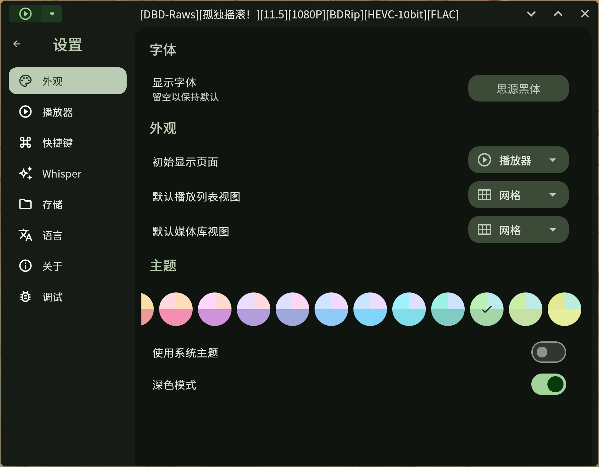

# Playboy Player
[中文](./README.md) | English  

A `libmpv` based media player with Material 3 design.

 
 

  

## Screenshots

<table>
  <tr>
    <td>
      
    </td>
    <td>
      
    </td>
  </tr>
  <tr>
    <td>
      
    </td>
    <td>
      
    </td>
  </tr>
  <tr>
    <td>
      
    </td>
    <td>
      
    </td>
  </tr>
</table>

## Features

- [x] Custom theme & dark mode
- [x] Play local and online media
- [x] Mini player mode (Windows & macOS)
- [x] Set as system default player (Windows)
- [x] Playlist features (shuffle, repeat one)
- [x] Adjustable playback speed
- [x] Search media files and playlists
- [x] Multi-language support
- [ ] Subtitles (libass)
- [ ] Shaders support, such as [Anime4K](https://github.com/bloc97/Anime4K)
- [ ] Customizable hotkey mapping
- [ ] Custom mpv options & commands

## For Developers

First, set up the Flutter environment according to the [official guide](https://docs.flutter.dev/get-started/install/). Please use Flutter version **3.29.0** or higher.

### Windows

Run `flutter build windows` in the project directory to generate the Windows executable.

### Linux

After setting up Flutter, install `libmpv-dev` via your system package manager or other means.

Run `flutter build linux` in the project directory to generate the Linux executable.

### macOS

Run `flutter build macos` in the project directory to generate the macOS executable.

### Android

> Please run on tablet devices.

Run `flutter build apk` to generate the APK installation file.

## Contributing to This Project

If you find a bug or want to suggest a feature, please [create a new issue](https://github.com/Playboy-Player/Playboy/issues/new).  
Pull requests with code contributions are also welcome.

## Star History

